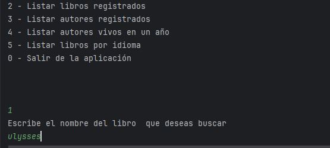
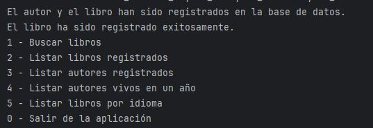
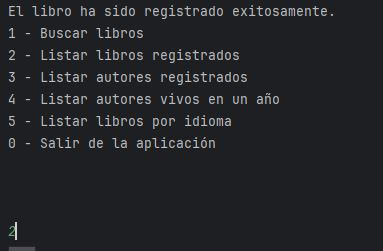
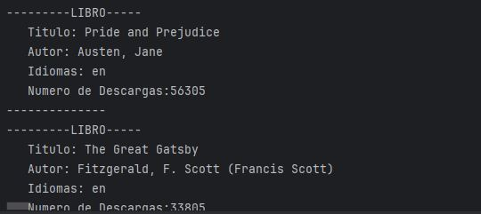
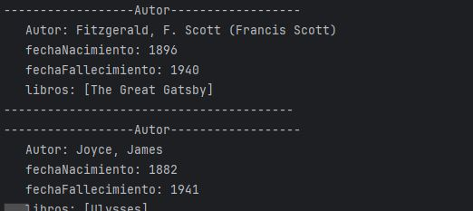
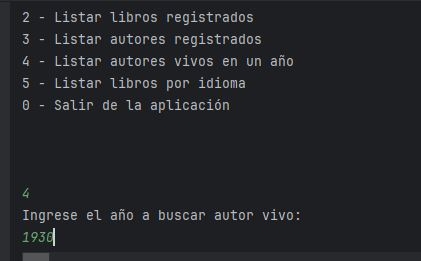
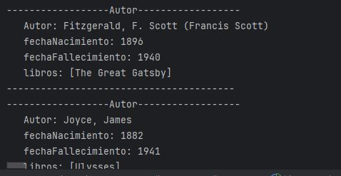
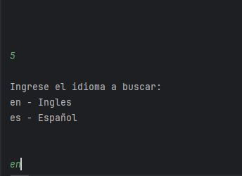

# Guía de Uso de la Aplicación "Gestor de Libros y Autores"

La aplicación es un programa en Java que interactúa con una API de libros (Gutendex) para buscar, registrar y gestionar información de libros y autores en una base de datos. A continuación, se describe cómo funciona y cómo utilizar sus características.

---

## Funcionalidades Principales

1. **Buscar libros**  
   Busca libros en la API de Gutendex mediante un término ingresado por el usuario. Si el libro no está registrado en la base de datos, se procesa su registro junto con su autor.

2. **Listar libros registrados**  
   Muestra todos los libros que están actualmente registrados en la base de datos.

   

    

   3. **Listar autores registrados**  
   Despliega todos los autores que se encuentran registrados en la base de datos.

   
   

   

4. **Listar autores vivos en un año específico**  
   Filtra y muestra autores que estaban vivos en un año proporcionado por el usuario.

   

    

5. **Listar libros por idioma**  
   Muestra los libros registrados en un idioma específico, como inglés (en) o español (es).
      

6. **Salir de la aplicación**  
   Cierra el programa.
